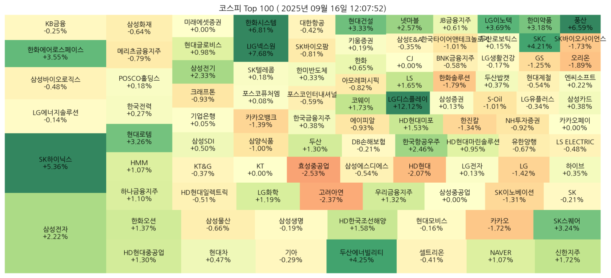

# Stock Visualizer - 코스피 Top 100 히트맵

한국 시가총액 상위 100개 기업을 대상으로 **실시간 주식 정보를 크롤링**하고, 

**트리맵 형태의 히트맵으로 시각화**하는 Python 앱입니다.

Streamlit을 이용해 웹 앱 형태로 띄우며, 새로고침 버튼으로 데이터를 갱신할 수 있습니다.

---

## 기능

- 한국 시총 100대 기업 데이터 크롤링 (네이버 금융)
- 종목별 **등락률, 시가총액** 기반 히트맵 시각화
- Streamlit 웹 앱에서:
  - 히트맵 실시간 확인
  - 새로고침 버튼으로 최신 데이터 갱신
  - 크롤링한 원본 데이터 검색 및 정렬 가능
- 히트맵 색상: **등락률** 기준  
  - 상승: 연두색, 하락: 빨간색
- 시가총액 차이에 따른 **사각형 크기 조절** (제곱근 변환 + 최소값 보정)

---

## 접속방법
http://13.125.246.86:8501/

> ⚠️ 이 서버는 AWS 무료 크레딧 기준으로 **2026년 3월 11일**까지 운영됩니다.  
> 그 이후에는 서비스가 종료될 수 있습니다.


## 설치

```bash
# 가상환경 생성 (선택)
python -m venv venv
source venv/bin/activate  # Linux / macOS
venv\Scripts\activate     # Windows

# 필수 패키지 설치
pip install -r requirements.txt
```

```bash
# 실행
streamlit run app.py
```
- 앱 실행 후 브라우저에서 실시간 히트맵 확인 가능

- 새로고침 버튼 클릭 시 최신 데이터 반영

## 프로젝트 구조
```bash
stock-visualizer/
├─ img/              # 이미지 폴더
├─ app.py            # Streamlit 웹 앱
├─ crawler.py        # 네이버 주식 크롤러
├─ visualizer.py     # 히트맵 시각화 함수
├─ requirements.txt  # 필수 패키지 목록
├─ README.md         # 프로젝트 설명
└─ CHANGElog.md      # 변경사항
```
## 기술 스택

- Python

- pandas, numpy

- matplotlib, squarify

- BeautifulSoup4

- Streamlit

## 시각 예시


## 개발 환경
- OS: Ubuntu 22.04 (WSL 2)
- Python: 3.12.3
- 가상환경: venv

